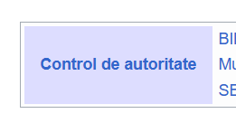
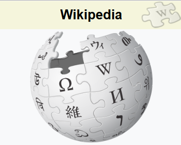
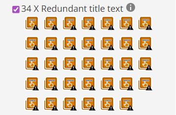

# Analiza folosind WAVE
Tool-ul folosit este [WAVE](https://wave.webaim.org/).
Site-ul analizat de mine este [Wikipedia](https://www.wikipedia.org/).

Nota: **8.1/10**

Cele mai _relevante_ probleme identificate de WAVE:

**1. Contrast prea mic intre nuantele de albastru folosite pentru text si culoarea de fundal a chenarului.**

 

**2. Lipsa link-ului pentru imaginea subiectului.**

- Acest lucru se repeta de inca 3 ori.

  

**3. Warning-uri in legatura cu reduntanta unor titluri.**

  

