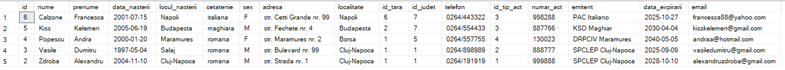
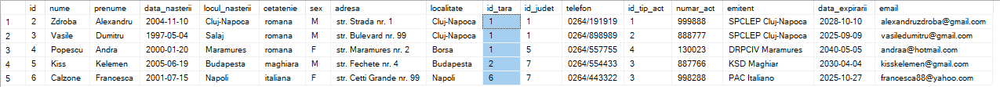

# Query results

```sql
--10. Să se ordoneze înregistrările crescător după câmpul Nume. 
SELECT * FROM InfoClienti
ORDER BY nume
```


---

```sql
--11. Să se ordoneze înregistrările descrescător după câmpul CodTara.
SELECT * FROM InfoClienti
ORDER BY id_tara
```



